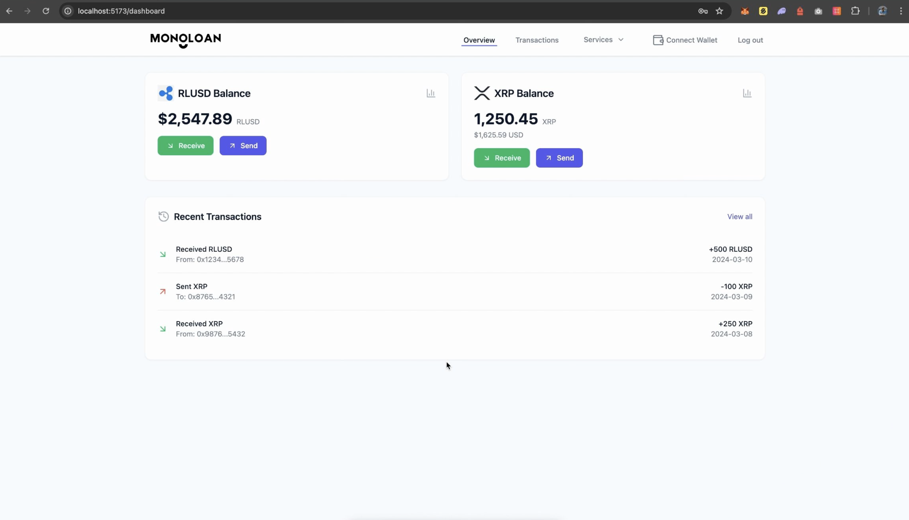
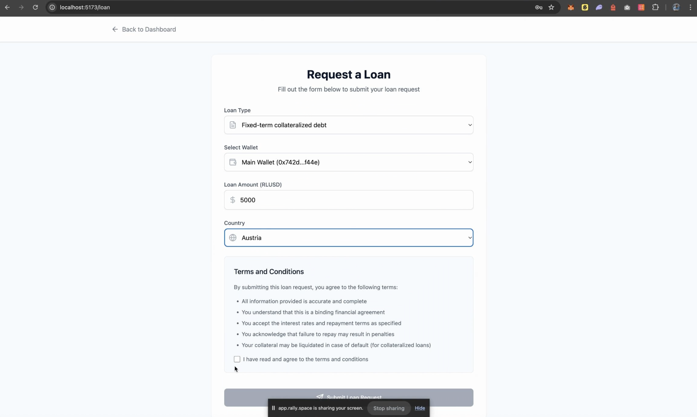

<p align="center">
  
</p>

<h1 align="center" style="margin-top: 0;">MonoLoan</h1>

<p align="center">
  <strong>Team: LadyBugs & Co. | Built for SwissHacks 2025 🚀</strong>
</p>

## 💡 Project Overview

**MonoLoan** is a decentralized loan and credit analysis platform built for blockchain users. It allows individuals to request loans based on their XRP wallet data.


The project consists of a **React + TypeScript frontend** and a **Node.js + Python backend**. 

---

> ⚠️ Warning: this is not all info on what we did!

> 🔐 React + TypeScript frontend | Node.js + Python backend | Supabase Auth | XRP Ledger integration

### 📸 UI Screenshots Examples

#### 💼 Dashboard  
The Dashboard shows the user's RLUSD and XRP wallet balances along with recent transactions. 



#### 📝 Request a Loan  
Users select loan type, wallet, amount, and country, then submit a request after agreeing to terms.



```
### Run Frontend

```bash
cd frontend
npm install
npm run dev
```

### 🔐 Auth & Wallet

- Uses **Supabase** for user authentication
- XRP Wallet support via `WalletConnect.tsx`

---

## 🖥️ Backend

Node.js API with Python-based blockchain analysis.

### 📁 Folder Structure (Backend)

```bash
backend/
├── analyze_wallet.py             # Python script for wallet analysis
├── asset_risk.py                 # Risk evaluation logic
├── fetch_wallet_data.py         # Pulls data from XRP Ledger
├── create_trustline.js          # Trustline management
├── send_rlusd.js                # RLUSD transaction handling
├── ledger_objects.csv           # Wallet ledger snapshot
├── token_balances.csv           # Wallet token data
├── nfts.csv                     # NFT data
├── xrp_transactions.csv         # Transaction history
├── src/
│   ├── routes/
│   │   └── pythonRoutes.js       # Express route triggering Python scripts
│   ├── app.js
│   ├── app.py
│   └── server.js                # Node.js entry point

```

### 🛠️ Run Backend

```bash
cd backend
npm install
node src/server.js
```

```bash
example

python analyze_wallet.py (address)
```

### 🧪 API Endpoint (examples)
| Endpoint | Description |
|----------|-------------|
| `GET /api/balance/:wallet` | Get XRP balance & trust lines |
| `GET /api/report/:wallet` | Fetch wallet data |
| `GET /api/analyze` | Analyze wallet data (credit score) |
| `GET /api/python/analyze` | Direct Python-based scoring |

---

### 🌍 Frontend API Usage (examples)

| Endpoint | Purpose |
|----------|---------|
| `POST /auth/signup` | Register a user via Supabase |
| `POST /auth/signin` | Login existing user |
| WalletConnect | Enables on-chain wallet integration |

---

## ✨ Features

- 🔍 Blockchain-based wallet credit analysis  
- 🪙 Real-time RLUSD + XRP wallet interaction  
- 🧾 Collateralized loan request flow  
- ⚡ Fast, modular React + Vite frontend  
- 🔐 Secure login with Supabase + WalletConnect  
- 📈 Python-backed analysis and CSV processing  
- 🎯 Hackathon-ready, extendable architecture  

---

## 🧠 Team

**Ladybugs & Co.**  
Built for [SwissHacks 2025](https://swisshacks.ch)

